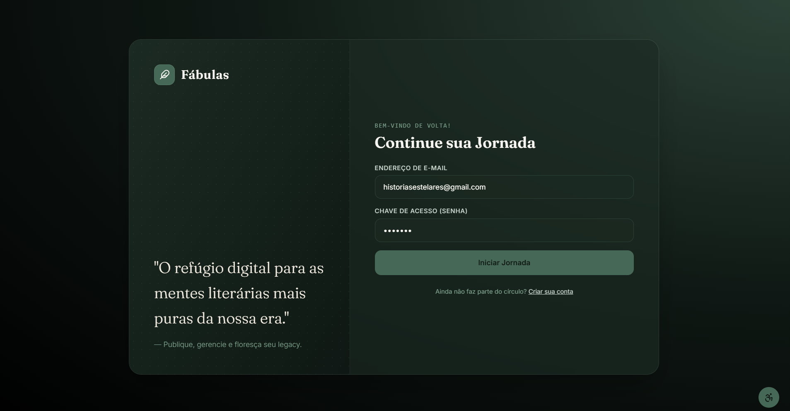
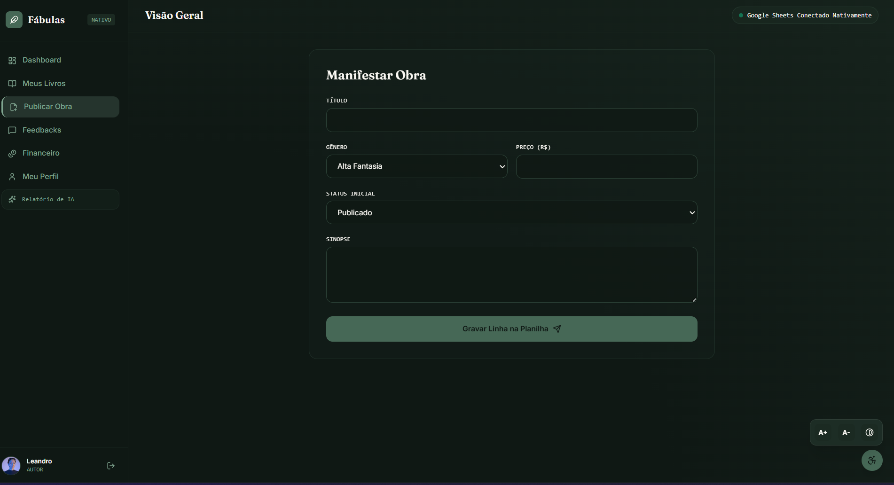
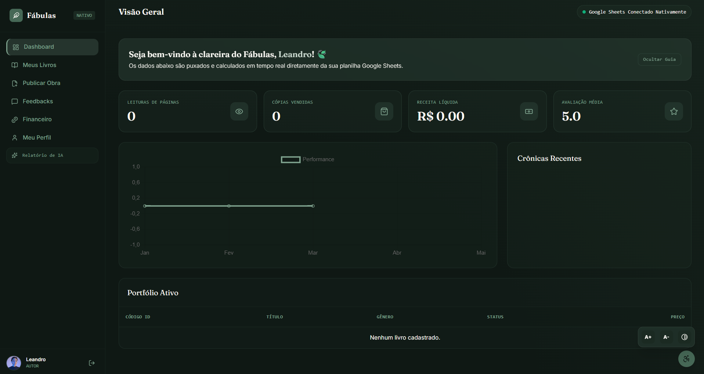

<h1> Fábulas</h1>
<h2>Plataforma de Publicação e Leitura Independente</h2>

  

O **Fábulas** é uma plataforma web conceitual de duas pontas desenvolvida para conectar autores independentes e leitores em um ecossistema focado na experiência do usuário. Inspirado em interfaces modernas como Kindle, Substack e Wattpad, o projeto adota uma estética *aconchegante* (minimalista, tons de floresta e natureza) com foco em imersão, acessibilidade e regras de negócio robustas.

O sistema utiliza **HTML5, CSS3, JavaScript (ES6+)** no front-end, utilizando o **Google Apps Script** como camada de microsserviços (API/Roteador) e o **Google Sheets** como banco de dados relacional simulado.

---
 
 
## Tecnologias Utilizadas

* **Front-end:**
* HTML5, CSS3 (Custom Variables & Keyframes), JavaScript (Vanilla ES6)
* **Back-end:**
* Google Apps Script (Engine de rotas e processamento de API)
* **Banco de Dados:**
*  Google Sheets (Estruturado com tabelas relacionais para Livros, Faturamento, Feedbacks e Gêneros Customizados)
* **Ícones:**
*  Lucide Icons
---
## Funcionalidades

### Ecossistema do Autor (Dashboard SaaS)

* **Estante de Criação:** Criação e acompanhamento de manuscritos com barras de progresso dinâmicas.
* 
*  
* **Métricas Financeiras Integradas:** Painel com cálculo real de Leitores Ativos, Minutos Lidos, Avaliação Média e Royalties Líquidos.
*  
* **Gerenciamento de Gêneros Dinâmicos:** Opção de expandir o banco de dados criando gêneros customizados em tempo real, sem necessidade de manutenção no código.
*  
   

---

<h2>Arquitetura e Engenharia de Software</h2>

### *Nota sobre a Infraestrutura (Serverless Conceitual)
**A opção pelo ecossistema Google (Apps Script e Sheets) foi uma decisão estratégica de arquitetura para este MVP. Ao utilizar o Google Sheets como um banco NoSQL/Relacional simulado através de chamadas de microsserviços via Apps Script, a plataforma atinge custo zero de infraestrutura e hospedagem, mantendo a reatividade dos dados. Essa abordagem simula o comportamento de arquiteturas modernas Serverless e demonstra a viabilidade de validações complexas mesmo em ambientes de restrição de recursos.**

### Motor de Regras de Negócio (Validation Engine)
Para garantir a integridade comercial da plataforma, o sistema conta com um motor de regras estrito no front-end e back-end:
* **Bloqueio de Monetização:** É vedada a venda de obras em rascunho. Caso o autor estipule um preço maior que R$ 0,00, a aplicação valida a requisição e força o status do livro para "Finalizado". Tentativas de burlar a interface bloqueiam o envio do formulário.

### Segurança e Roteamento Isolado
Diferente de aplicações geradas por templates comuns, o Fábulas utiliza roteamento dinâmico via parâmetros de URL gerenciados pela função `doGet(e)` no Google Apps Script. 
* Usuários com a flag `visao=autor` acessam o ambiente de edição (`Index.html`).
* Esse isolamento físico de arquivos impede que vazamento de escopo ocorra no lado do cliente.

### Alinhamento com a LGPD
O projeto foi estruturado seguindo os princípios de *Privacy by Design* previstos na Lei Geral de Proteção de Dados (Lei nº 13.709/2018):
1. **Princípio da Finalidade e Adequação:** Coleta mínima de dados (apenas pseudônimo, notas e textos de opinião).
2. **Segurança dos Dados:** O banco de dados é hospedado no ambiente seguro do Google Workspace do administrador, mitigando vulnerabilidades de servidores de terceiros.
3. **Isolamento de Privilégios:** Leitores não possuem privilégios de leitura na aba de faturamento global ou dados privados de outros autores.

---

## Acessibilidade Funcional (Universal Design)

A interface conta com uma barra flutuante de acessibilidade nativa que altera o comportamento do DOM via JavaScript em tempo real:
* **Redimensionamento Dinâmico de Tipografia:** Controle de escala para conforto visual (A+ / A-) que recalcula as proporções do texto proporcionalmente.
* **Mecanismo de Alto Contraste:** Inversão instantânea da paleta de cores para padrões de alta legibilidade, redefinindo as variáveis CSS globais do projeto sem quebrar o layout ou a responsividade do dashboard.

---
<h2>(Próximas Etapas)</h2>
O projeto foi arquitetado para suportar uma expansão de duas pontas. Embora o foco inicial do MVP tenha sido a consolidação do Painel do Autor e da estrutura de banco de dados, as seguintes funcionalidades já possuem mapeamento lógico e estão programadas para as próximas iterações:

1.Ecossistema do Leitor (Rede Social de Leitura)
Feed de Exploração Pleno: Implementação da interface exclusiva para o perfil de leitor, servindo como uma vitrine dinâmica que renderizará e filtrará os livros disponíveis no banco de dados.

2.Sistema de Feedback e Comunidade: Criação de seção interativa de engajamento, permitindo que leitores cadastrados deixem avaliações (1 a 5 estrelas) e comentários textuais que atualizarão a reputação geral do livro de forma automática na planilha.

3.Módulo de Carrinho e Leituras Atuais: Desenvolvimento do fluxo completo de consumo, com separação entre a aquisição de obras gratuitas e a simulação de compra para obras pagas, garantindo que o ambiente do leitor permaneça totalmente isolado do painel administrativo.

---
